<h1 align="center">Hi 👋! My name is Sagar Shrestha</h1>
<h3 align="center">and I'm a Rookie Learner</h3>

 

## 🛠️ Tech Stack

  

 

## 📊 GitHub Stats

  
  

  

  

Cards are generated daily by this repo's own GitHub Action — no third-party stats service.

